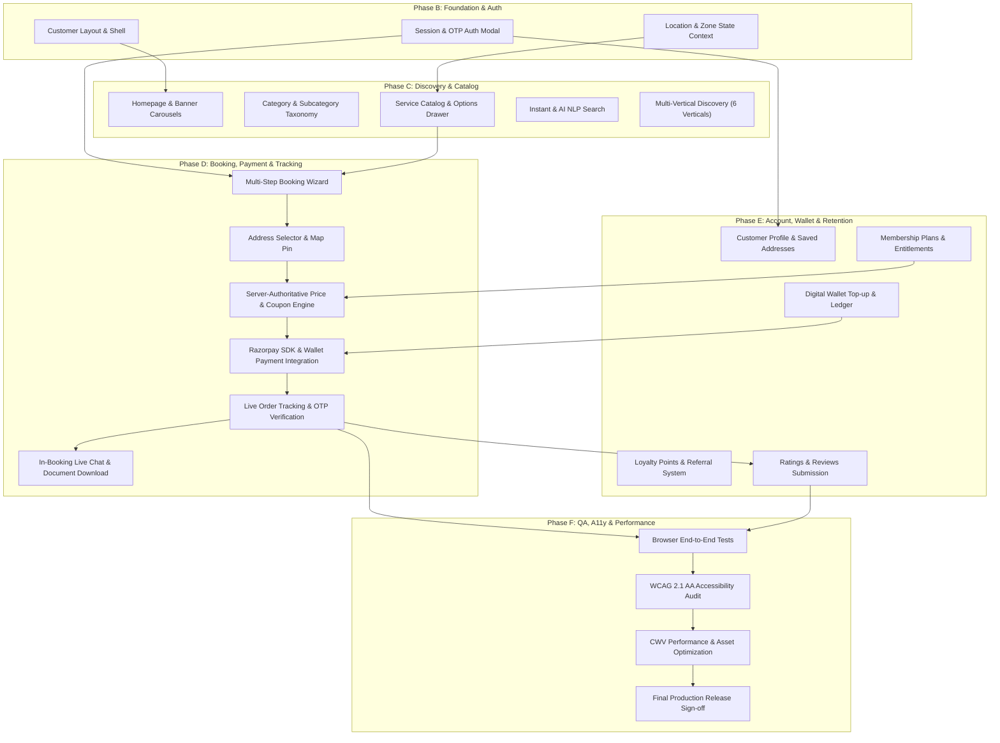

# 1CallFix Super App — Customer Web App Implementation Plan

> **Scope:** Customer-Facing Web Application Architecture & Build Plan  
> **Guiding Principle:** **Zero Backend Rebuild.** The existing backend (233 migrations, 125 models, 77 services, 22 actions, 108 tests) is authoritative and production-ready. This plan delivers the complete Livewire 4 / Tailwind CSS v4 customer web application mapped cleanly onto existing services and APIs.  
> **Date:** 2026-08-27

---

## 1. Phased Architecture & Execution Roadmap

---

## Phase B: Frontend Foundation & Authentication

### Objective
Establish the customer application layout shell, mobile-responsive navigation system, session-based customer authentication modal (using the existing `OtpService`), and client-side zone/location detection context.

### Features
1. **Customer Master Layout (`layouts.customer`)**:
   - Header with brand logo, delivery address / zone selector modal trigger, omni-search input, notifications indicator, and user login/profile pill.
   - Responsive mobile bottom navigation bar (Home, Categories, Orders, Wallet, Profile).
   - Flash notification toaster system.
2. **Customer Authentication System (`Livewire\Customer\Auth\OtpModal`)**:
   - Two-step interactive modal: (1) Phone number input with 5-attempt rate limiter, (2) 6-digit OTP entry with auto-focus and 60-second resend countdown.
   - Integrates with `OtpService::generate()` and `OtpService::verify()`.
   - Provisions or logs in customer session (`Auth::guard('web')->login($user)`).
   - Seamless session recovery upon refresh.
3. **Location & Zone Resolution Context (`Livewire\Customer\LocationPicker`)**:
   - Browser geolocation detection with Leaflet map fallback (`resources/views/components/address-map.blade.php`).
   - Resolves active `Zone` and `Franchise` via reverse geocoding & spatial boundary check.
   - Persists chosen address/zone in session.

### Files Likely Affected / Created
- **[NEW]** `resources/views/layouts/customer.blade.php` — Customer master layout
- **[NEW]** `app/Livewire/Customer/Auth/OtpModal.php` — Livewire customer auth component
- **[NEW]** `resources/views/livewire/customer/auth/otp-modal.blade.php`
- **[NEW]** `app/Livewire/Customer/LocationPicker.php` — Location & zone resolution modal
- **[NEW]** `resources/views/livewire/customer/location-picker.blade.php`
- **[NEW]** `resources/views/components/customer/navbar.blade.php`
- **[NEW]** `resources/views/components/customer/bottom-nav.blade.php`
- **[MODIFY]** `routes/web.php` — Register customer web route groups

### Backend & API Dependencies
- `app/Services/OtpService.php` (Existing)
- `app/Models/Otp.php`, `app/Models/User.php`, `app/Models/Zone.php`, `app/Models/Franchise.php` (Existing)
- Session guard configured in `config/auth.php` (Existing)

### Tests Required
- `tests/Feature/CustomerWeb/CustomerAuthTest.php`: Tests OTP request, invalid OTP, rate-limit lockouts, successful session login, customer user provisioning.
- `tests/Feature/CustomerWeb/LocationPickerTest.php`: Tests zone detection, session storage of active coordinates and franchise.

### Browser Tests Required
- Full browser flow: Open site → Click Login → Enter phone → Receive mocked OTP → Verify → Assert navbar updates with user profile name.

### Risks & Mitigations
- *Risk:* Livewire session state falling out of sync with Sanctum API tokens.
- *Mitigation:* Ensure customer web routes run on the `web` session middleware group while preserving Sanctum for external API clients.

### Recommended Agent: **Agent 2 (Frontend Foundation & Auth)**

---

## Phase C: Discovery & Catalog

### Objective
Build high-converting discovery interfaces including the dynamic homepage, category taxonomy explorer, service details with option selectors, real-time search, and discovery views for the other 6 verticals.

### Features
1. **Customer Homepage (`Livewire\Customer\Home`)**:
   - Hero banner carousel filtered by active zone (`Banner::scopeForSlot()`).
   - Quick-access vertical launcher tiles (Home Services, Courier/Parcel, Taxi Rides, Rentals, Hotels, Marketplace).
   - Featured categories grid and top-rated local services.
   - Time-limited flash sale countdown ticker (`FlashSaleService::priceFor()`).
2. **Category & Subcategory Explorer (`Livewire\Customer\Categories`)**:
   - Two-pane category/subcategory navigation tree.
   - Dynamic service count badges.
3. **Service Catalog & Option Configuration Drawer (`Livewire\Customer\Services\Index` & `Show`)**:
   - Grid listing with real-time price resolution (`Service::resolvePrice($franchiseId)`).
   - Slide-over service detail drawer with duration estimate, warranty tag, and interactive option groups (`ServiceOptionGroup`, `ServiceOption`).
4. **Search & AI/NLP Filter (`Livewire\Customer\Search`)**:
   - Instant search dropdown as user types.
   - Natural language search input (e.g. *"AC deep clean tomorrow afternoon in Nellore"*) utilizing `BookingNaturalLanguageFilter`.
5. **Multi-Vertical Browse Screens**:
   - Accommodations catalog (`HotelController` parity), Rental vehicles/machinery (`VehicleController`/`EquipmentController` parity), Store marketplace (`StoreController`/`ProductController` parity).

### Files Likely Affected / Created
- **[NEW]** `app/Livewire/Customer/Home.php` & `resources/views/livewire/customer/home.blade.php`
- **[NEW]** `app/Livewire/Customer/Categories.php` & `resources/views/livewire/customer/categories.blade.php`
- **[NEW]** `app/Livewire/Customer/Services/Index.php` & `resources/views/livewire/customer/services/index.blade.php`
- **[NEW]** `app/Livewire/Customer/Services/Show.php` & `resources/views/livewire/customer/services/show.blade.php`
- **[NEW]** `app/Livewire/Customer/Search.php` & `resources/views/livewire/customer/search.blade.php`
- **[NEW]** `app/Livewire/Customer/Hotels/Index.php` & `resources/views/livewire/customer/hotels/index.blade.php`
- **[NEW]** `app/Livewire/Customer/Rentals/Index.php` & `resources/views/livewire/customer/rentals/index.blade.php`
- **[NEW]** `app/Livewire/Customer/Marketplace/Index.php` & `resources/views/livewire/customer/marketplace/index.blade.php`

### Backend & API Dependencies
- `app/Services/FlashSaleService.php`, `app/Services/Ai/BookingNaturalLanguageFilter.php` (Existing)
- `app/Models/Service.php`, `app/Models/ServiceCategory.php`, `app/Models/ServiceOptionGroup.php`, `app/Models/Banner.php` (Existing)

### Tests Required
- `tests/Feature/CustomerWeb/CatalogDiscoveryTest.php`: Verifies category rendering, franchise price override display, option selections.
- `tests/Feature/CustomerWeb/CustomerSearchTest.php`: Tests keyword search and natural language filter execution.

### Browser Tests Required
- Select zone → Click category → Open service drawer → Select options → Assert total price updates live.

### Recommended Agent: **Agent 3 (Discovery & Catalog)**

---

## Phase D: Booking, Payment & Tracking

### Objective
Implement the complete end-to-end service booking checkout, server-authoritative price calculation, Razorpay gateway integration, digital wallet settlement, real-time job status tracking, and verification OTP interaction.

### Features
1. **Multi-Step Booking Checkout (`Livewire\Customer\Booking\Checkout`)**:
   - **Step 1 — Schedule:** Date picker & time slot selector (validates against business hours and minimum lead time).
   - **Step 2 — Location:** Select saved address or drop pin on Leaflet map (`AddressController::store` logic).
   - **Step 3 — Review & Pricing:** Server-authoritative summary showing base price + options + franchise delta - promo coupon (`Coupon` check) - membership entitlement deduction (`EntitlementService`) + taxes.
   - **Step 4 — Payment:** Choice of Online Gateway (Razorpay), Digital Wallet, or Cash on Completion.
2. **Razorpay Client-Side Payment Gateway Integration**:
   - Razorpay standard checkout popup script initialization using `PaymentGateway::createOrder()`.
   - Automated signature submission (`PaymentController::confirm()` / `PaymentGateway::verifyPaymentSignature()`).
   - Seamless handling of payment failures, dismissal, and retry loops.
3. **Live Order Tracking & Status Screen (`Livewire\Customer\Booking\Track`)**:
   - Real-time polling of booking lifecycle states: `pending` → `searching` → `accepted` → `in_progress` → `completed`.
   - Assigned worker card displaying technician name, photo, ratings, and phone call link.
   - Display of customer's secure **Start OTP** and **Completion OTP** for technician verification.
4. **Post-Booking Interactive Features**:
   - In-booking Livewire Chat component (`ChatService` integration).
   - Instant PDF Invoice download link calling `DocumentController::paymentDocument()`.
   - One-click booking cancellation modal with fee preview (`CancellationService`).
   - Post-completion Star Rating & Review submission (`ReviewService`).

### Files Likely Affected / Created
- **[NEW]** `app/Livewire/Customer/Booking/Checkout.php` & `resources/views/livewire/customer/booking/checkout.blade.php`
- **[NEW]** `app/Livewire/Customer/Booking/Track.php` & `resources/views/livewire/customer/booking/track.blade.php`
- **[NEW]** `app/Livewire/Customer/Booking/Chat.php` & `resources/views/livewire/customer/booking/chat.blade.php`
- **[NEW]** `app/Livewire/Customer/Booking/CancelModal.php` & `resources/views/livewire/customer/booking/cancel-modal.blade.php`
- **[NEW]** `app/Livewire/Customer/Booking/ReviewModal.php` & `resources/views/livewire/customer/booking/review-modal.blade.php`
- **[MODIFY]** `resources/views/layouts/customer.blade.php` (add Razorpay checkout script bundle)

### Backend & API Dependencies
- `app/Actions/CreateBookingAction.php` (Existing)
- `app/Actions/AdminCancelBookingAction.php` (Existing)
- `app/Services/Payments/PaymentGatewayManager.php` & `RazorpayPaymentDriver.php` (Existing)
- `app/Services/CancellationService.php`, `app/Services/ReviewService.php`, `app/Services/ChatService.php` (Existing)
- `app/Services/Documents/DocumentService.php` & DomPDF (Existing)

### Tests Required
- `tests/Feature/CustomerWeb/BookingCheckoutTest.php`: Exercises full booking creation with options, coupon application, and validation rules.
- `tests/Feature/CustomerWeb/PaymentProcessingTest.php`: Tests Razorpay signature verification and wallet payment deduction.
- `tests/Feature/CustomerWeb/OrderTrackingTest.php`: Tests state progression, OTP display, chat message dispatch, and invoice download.

### Browser Tests Required
- Full booking lifecycle: Pick service → Choose date/address → Checkout with Razorpay mock → Track status → Complete with OTP → Leave 5-star review → Download PDF invoice.

### Recommended Agent: **Agent 4 (Booking, Payment & Orders)**

---

## Phase E: Account, Wallet, Membership & Retention

### Objective
Deliver customer self-service account management, virtual wallet top-up/history, subscription membership tiers with automated booking discounts, loyalty rewards redemption, and referral sharing.

### Features
1. **Customer Account Dashboard (`Livewire\Customer\Account\Profile`)**:
   - View/edit full name, email, preferred language, and notification settings.
   - Saved Address Book CRUD with default address toggle and map geocoding.
2. **Customer Order History (`Livewire\Customer\Account\Orders`)**:
   - Tabbed order history across all verticals (Services, Parcel, Taxi, Hotels, Rentals, Marketplace).
   - Status filters (Active, Completed, Cancelled) and repeat booking button.
3. **Digital Wallet Hub (`Livewire\Customer\Account\Wallet`)**:
   - Live wallet balance widget.
   - One-click top-up amount selector with instant Razorpay checkout (`WalletTopUpService`).
   - Complete credit/debit transaction ledger with reference IDs and refund notes.
4. **VIP Membership & Subscription Plans (`Livewire\Customer\Account\Membership`)**:
   - Plan comparison cards (Silver, Gold, VIP) showing entitlements and monthly/yearly pricing.
   - One-click subscription checkout (`SubscriptionService::initiateSubscribe()`).
   - Active entitlement balance meters (e.g. *3 of 5 free bookings remaining*).
5. **Loyalty Program & Referral Dashboard (`Livewire\Customer\Account\Rewards`)**:
   - Loyalty points balance with "Convert to Wallet Cash" button (`LoyaltyService::redeem()`).
   - Personal referral link and code generator with WhatsApp/SMS share triggers (`ReferralService`).

### Files Likely Affected / Created
- **[NEW]** `app/Livewire/Customer/Account/Profile.php` & `resources/views/livewire/customer/account/profile.blade.php`
- **[NEW]** `app/Livewire/Customer/Account/Addresses.php` & `resources/views/livewire/customer/account/addresses.blade.php`
- **[NEW]** `app/Livewire/Customer/Account/Orders.php` & `resources/views/livewire/customer/account/orders.blade.php`
- **[NEW]** `app/Livewire/Customer/Account/Wallet.php` & `resources/views/livewire/customer/account/wallet.blade.php`
- **[NEW]** `app/Livewire/Customer/Account/Membership.php` & `resources/views/livewire/customer/account/membership.blade.php`
- **[NEW]** `app/Livewire/Customer/Account/Rewards.php` & `resources/views/livewire/customer/account/rewards.blade.php`

### Backend & API Dependencies
- `app/Services/WalletService.php` & `WalletTopUpService.php` (Existing)
- `app/Services/Plans/SubscriptionService.php` & `EntitlementService.php` (Existing)
- `app/Services/LoyaltyService.php` & `ReferralService.php` (Existing)

### Tests Required
- `tests/Feature/CustomerWeb/WalletManagementTest.php`: Tests wallet top-up flow and ledger accuracy.
- `tests/Feature/CustomerWeb/MembershipSubscriptionTest.php`: Tests plan purchase, entitlement activation, and entitlement consumption during booking.
- `tests/Feature/CustomerWeb/LoyaltyAndReferralTest.php`: Tests loyalty redemption to wallet and referral code generation.

### Recommended Agent: **Agent 5 (Account & Retention)**

---

## Phase F: Complete QA, Accessibility & Performance

### Objective
Execute full-scale regression testing, automated browser end-to-end suites, WCAG 2.1 AA accessibility auditing, Core Web Vitals (LCP, CLS, INP) optimization, and production release readiness certification.

### Verification Matrix
1. **Automated Test Suite**:
   - Run all 108 existing backend tests + new customer web test suite via `php artisan test`.
   - Zero test failures, zero deprecated methods.
2. **Accessibility (a11y) Compliance**:
   - Semantic HTML5 landmark structure (`<main>`, `<nav>`, `<header>`, `<footer>`).
   - Full keyboard navigation and focus trapped in modals (`OtpModal`, `LocationPicker`, `Checkout`).
   - Color contrast ratio >= 4.5:1 on light/dark backgrounds.
   - ARIA labels on all icon-only buttons and interactive cards.
3. **Frontend Performance & Asset Optimization**:
   - Vite production build optimization (`npm run build`).
   - Zero layout shifts (CLS < 0.1) on dynamic image/banner loading.
   - Sub-second Largest Contentful Paint (LCP < 1.2s) on homepage and service catalog.
4. **Security & Production Hardening**:
   - Enforce CSRF protection on all Livewire actions.
   - Verify non-logged-in customers cannot access authenticated order tracking or wallet data.
   - Ensure debug stack traces are never exposed when `APP_DEBUG=false`.

### Recommended Agent: **Agent 1 (Orchestration & Release QA)**

---

## Summary of Agent Delegation & Handoff

| Agent | Domain / Scope | Key Deliverables | Dependencies |
|:---|:---|:---|:---|
| **Agent 1** | **Orchestration, Review & Release QA** | Architectural alignment, Phase F testing, a11y audit, release sign-off | Oversees Agents 2–5 |
| **Agent 2** | **Frontend Foundation & Customer Auth** | `layouts.customer`, `OtpModal`, `LocationPicker`, session auth bridge | Existing `OtpService`, Tailwind v4, Vite |
| **Agent 3** | **Discovery & Service Catalog** | Homepage, Categories, Service Catalog, Options Drawer, Instant & NLP Search | Agent 2 layout, `Service` models |
| **Agent 4** | **Booking, Payment & Order Tracking** | Multi-step Booking Checkout, Razorpay integration, Tracking, OTP, Chat | Agent 2 auth, Agent 3 catalog, `CreateBookingAction` |
| **Agent 5** | **Account, Wallet & Retention** | Customer Profile, Addresses, Wallet Top-up, Membership Plans, Loyalty | Agent 2 auth, `WalletService`, `SubscriptionService` |
